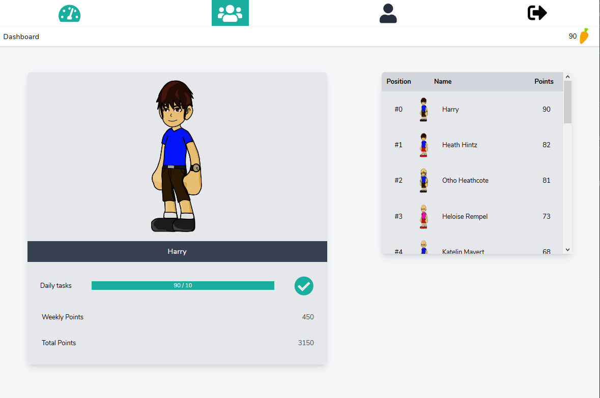

# Motiva
Slash 2020: Homework Motivator - Create your virtual avatar

## The idea

The project's goal is to motivate young kids (< 12 years) to do their homework. In each lesson, the teacher checks the homework and with his smartphone, he can use the motiva web app to select which kids have done their work properly. For each finished task, the kids get so-called "carrots" with which they can by items for a virtual avatar. With these avatars, the student can chat with each other or also play mini-games.

The project was created during the [Slash Hackathon](https://slash.berlin/) 2020.

Motiva is currently not ready for production.

## What is working so far

* registration of students via web interface (teachers have to be set manually)
* logins
* simple avatars (see screenshot below)
* teacher interface: create tasks, select students that finished their homework
* storing and displaying the "carrot" count for each student


Note: some parts of the UI are currently mocked, therefore the point counts are not displayed correctly ;)

## What has to be done

* buying avatar items (currently all available items can be used)
* teacher registration
* allow multiple classes per teacher
* chat function (currently only mockup)
* mini games

## Further ideas

* [pomodoro](https://en.wikipedia.org/wiki/Pomodoro_Technique) timer
* assign homeworks online
* check homeworks online (photo send to teacher / multiple choice)

## Tech stack

The project is based on [laravel](https://laravel.com/), which is a php framework. We know that there might be developers having prejudices against php. But with laravel, php is enhanced to a modern framework comparable to [https://spring.io/projects/spring-boot](https://spring.io/projects/spring-boot).

## Developing with Docker

Advantage: Only a docker installation needed. Disadvantage: May be slower than xampp on windows (due to WSL).

Open a terminal inside the `motiva` folder and run the following commands (for windows cmd, replace `$PWD` with `%cd%`, for powershell use `${pwd}`):
```bash
cp .env.example .env

docker run --rm --interactive --tty --volume $PWD:/app composer:1.10.13 install

docker run -it --rm --name my-running-script -v ${PWD}:/app -w /app node:12 bash -c "npm install; npm run dev"

# start an SQL database server
docker run --name motiva_mariadb -e MYSQL_RANDOM_ROOT_PASSWORD=yes -e MYSQL_DATABASE=laravel -e MYSQL_USER=laraveluser -e MYSQL_PASSWORD=my-secret-pw -p 3306:3306 mariadb

# in a second terminal, start the web server
docker run --rm --interactive --tty --name motiva_laravel --volume $PWD:/app -p 80:80 -e WEB_DOCUMENT_ROOT=/app/public -t webdevops/php-nginx-dev:7.4

# in a third terminal, enter the web server's container and init the database with example data (see below)
docker exec -i -t motiva_laravel bash
    cd /app
    php artisan key:generate
    php artisan migrate:fresh --seed
```

## Development with XAMPP

First install [xampp](https://www.apachefriends.org), [composer](https://getcomposer.org) and [nodejs](https://nodejs.org).

In the xampp panel, start apache and php and open phpmyadmin. There, create a new table named "laravel".

In the motiva folder, copy `.env.example` to `.env`. In `.env`, set the database hostname to localhost and clear the username and password fields:

```
DB_HOST=localhost
DB_USERNAME=
DB_PASSWORD=
```

The other variables can be kept the same. Then execute in the motiva folder:

```bash
composer install
npm install
npm run dev
php artisan key:generate
php artisan migrate:fresh --seed
```

Finally, configure the XAMPP Apache server to point to `path_to_motiva/public`, by changing the `httpd.conf` file (xampp panel -> apache -> config -> httpd.conf) (usually you have to change two lines with `DocumentRoot ...` and `<Directory ...>`).

## Default seeded example data

| User | Email | Password |
| ---- | ---- | ----|
| Dumbledore | dumbledore@h | 123 |
| Harry | harry@h | 456 |

## Contributing

We highly appreciate new ideas or feature implementations for Motiva. Just file an issue or open a pull request on Github.